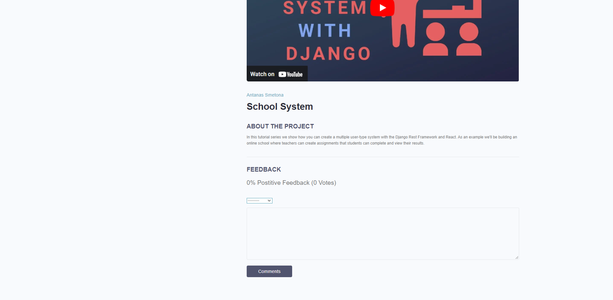
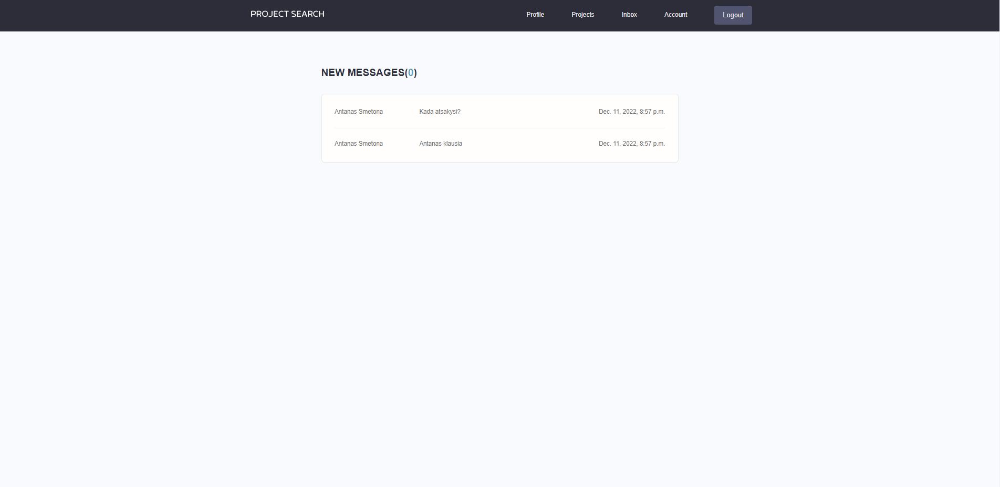

# This is my final project from Code Academy

# Installation
* 1 - clone repo https://github.com/vuvusim/final_project.git
* 2 - create a virtual environment and activate
*  - py -m venv venv
*  - venv\Scripts\activate
* 3 - cd into project "cd website"
* 4 - pip install -r requirements.txt
* 5 - py manage.py runserver

# Features
* Share Projects
* Message other Users
* Rate others work
* Search other Users

# Tech Stack
* Python
* Django
* Django REST Framework

# Home Page
 

# Projects Page
 

# User Page
 

# Login Page

# Feedback

# Inbox

# Add Skill

# Add Project

# User profile edit form
